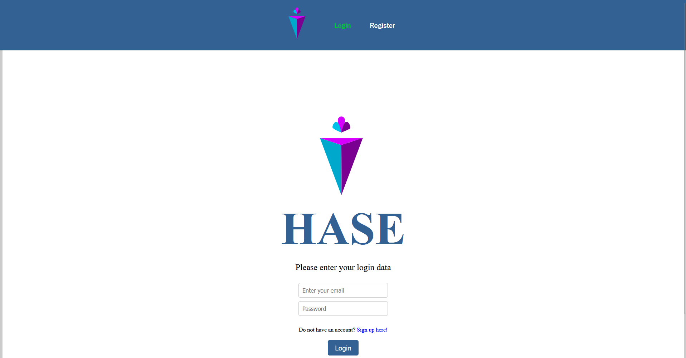
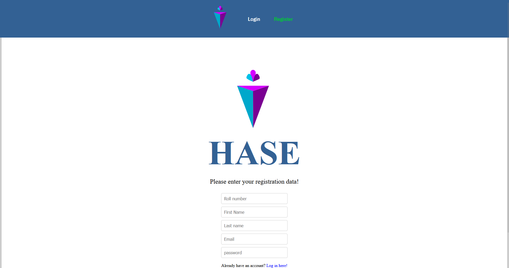
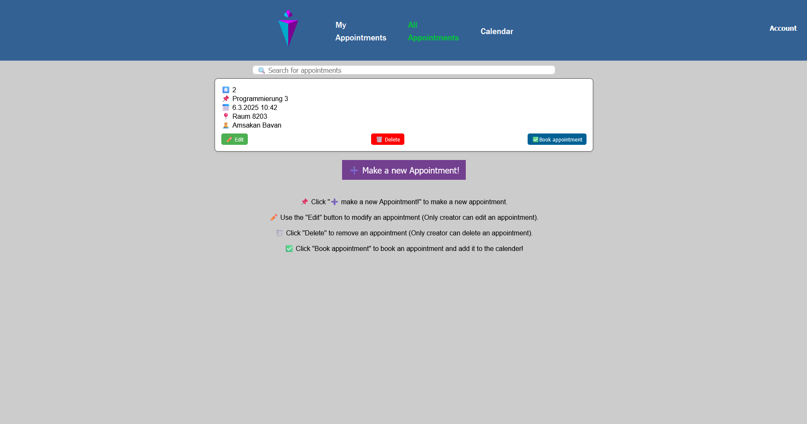
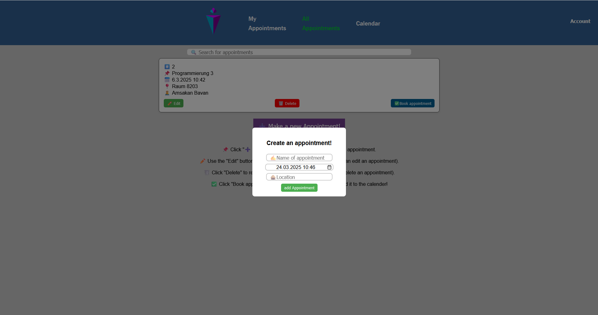
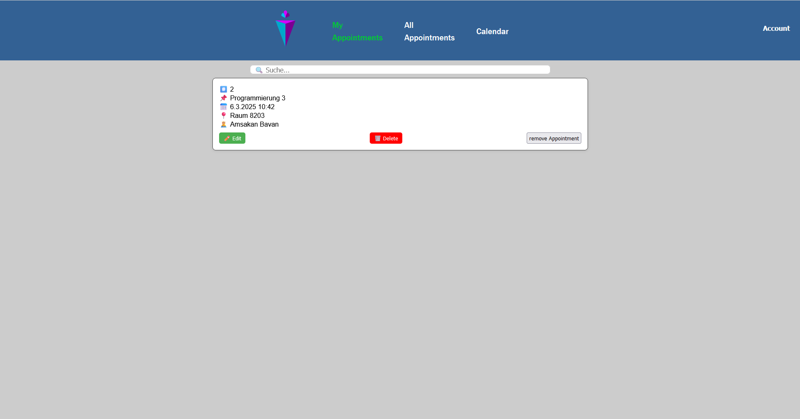
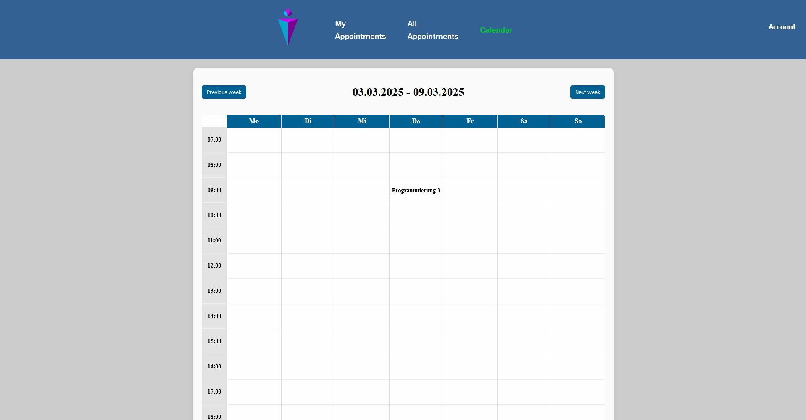
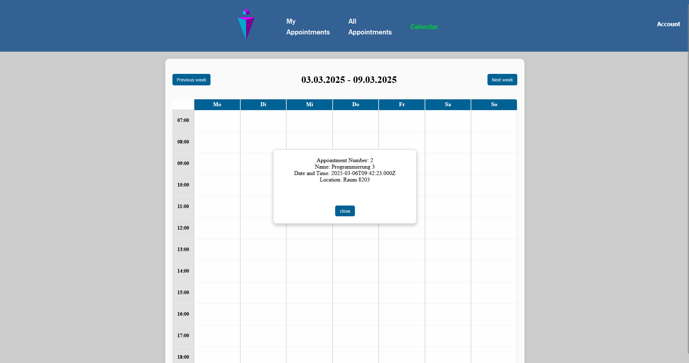
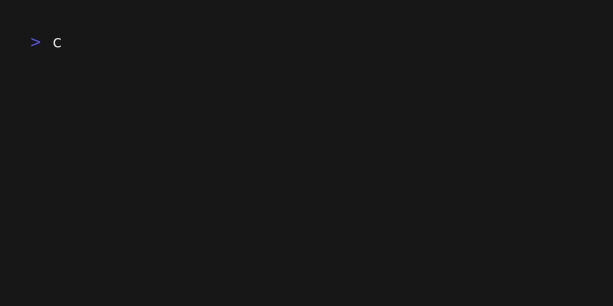

<div align="center">
    <h1>HASE</h1>
    
    <h2>A calendar for you and your study group.</h2>
</div>

### 💬 About 

HASE is a web application which helps you organize your study group by having a common pool of appointments. Within that, everyone can choose
their dates and include them into their individual calendar.

It is a project for the module "Programming 3" at the University of Applied Sciences Saarland and is being developed by **H**anan Ahmad Ashir,
**A**msakan Bavan, **S**ophia Sarkhovska and **E**rwin Holzhauser.

### ✨ Features

#### 👥 User system for you and your peers
<div align="center">
    </img>
    </img> 
</div>

#### 🖊️ Intuitive appointment creation

<div align="center">
    </img> </img> 
</div>

#### 📅 Easy management of own appointments thanks to a list and calendar view

<div align="center">
    </img> </img> </img>
</div>

### 🛠️🚀 Build and Run

We have to build two components for HASE. The frontend, which will be displayed on your web browser
and the backend that runs in the background for managing your appointments and users.

#### Requirements for building HASE

In order to build and run HASE your computer needs to have the following system requirements:

- An installation of <a href="https://maven.apache.org/download.cgi">Maven</a> and <a href="https://git-scm.com/downloads">git</a>
- <a href="https://nodejs.org">Node.js</a> version >= v21.2.0
- <a href="https://www.java.com/de/download/">Java</a> version >= 21

#### Step 1: Clone the HASE repository

This can be done by copying the URL of this repository from the browser navigation bar and running
git clone on it, as shown below.


#### Step 2: Build the backend

The backend can be build by doing the following:

```bash
cd hase
cd backend
mvn clean install
```


This will run the building process for the backend. The binary of the backend will then be stored in the 
target directory. After successful building of the backend, you can run

##### macOS and Linux (bash)

```bash
cd target
java -jar hasev2-*.jar
```

##### Windows (PowerShell)

```pwsh
cd target
java -jar (Get-ChildItem hasev2-*.jar).Name
```



And the backend will be started.

#### Step 3: Run the frontend

Now that we have built the backend, we can run the frontend and use HASE. This can be done by opening up a new terminal window and
doing the following:

````bash
cd <path where you have cloned HASE>
cd frontend
npm install
npm run build
npm run preview
````


This will start up a local web server which will be available under the given address and
then can be accessed from your web browser.

**Congratulations!**<br>
You have build HASE and now have a running instance of it! 😀
