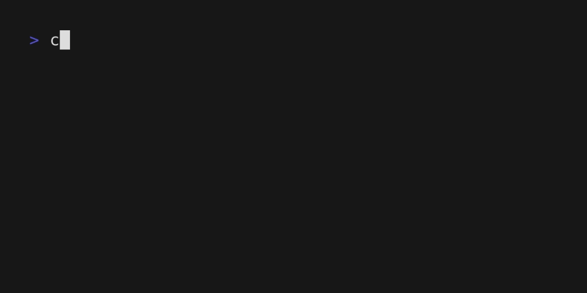

<h1 style="text-align:center;">HASE</h1>

## A calendar for you and your study group.

### About 

HASE is a web application, which helps you organize your study group by having a common pool of appointments, which everyone
can put into their own individual calendar.

It is a project for the module "Programming 3" at the University of Applied Sciences Saarland and is being developed by **H**anan Ahmad Ashir,
**A**msakan Bavan, **S**ophia Sarkhovska and **E**rwin Holzhauser.

### Build and Run

We have to build two components for HASE. The frontend, which will be displayed on your web browser
and the backend, which runs in the background for managing your appointments and users.

#### Step 1: Clone the HASE repository

This can be done by copying the URL of this repository from the browser navigation bar and running
git clone on it, as shown below.


#### Step 2: Build the backend

The backend can be build by doing the following:

```bash
cd hase
cd backend
mvn clean install
```


This will run the building process for the backend. The binary of the backend will then be stored in the 
target directory. After successful building of the backend, you can run

```bash
cd target
mkdir database
java -jar hasev2-*.jar
```



And the backend will be started.

#### Step 3: Run the frontend

Now that we have built the backend, we can now run the frontend and use HASE. This can be done by
doing the following:

````bash
cd ../frontend
npm install
npm run preview
````


This will start up a local web server, which will be available under the given address, which you can
then access from your web browser.

**Congratulations!**<br>
You have build HASE and have now a running instance of it! 😀